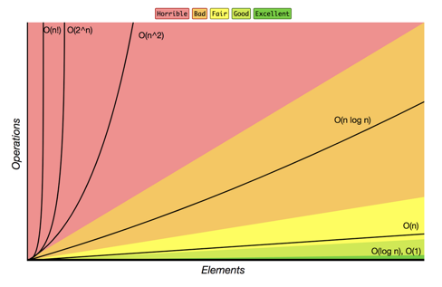

# syntra-web-development-intro

## Getting started

1. Install nodejs from this site: [Node.JS](https://nodejs.org/en/)
2. Install VS Code from this site: [VS Code](https://code.visualstudio.com/download)
3. Install Github Desktop from here: [Github Desktop](https://desktop.github.com/)
4. Clone the github repo from [here](https://github.com/Temmermans/syntra-web-development-intro)

## Time Complexity

Time complexity of an algorithm signifies the total time required by the program to run to completion. The time complexity of algorithms is most commonly expressed using the big O notation.

Big O notation gives us an industry-standard language to discuss the performance of algorithms. Not knowing how to speak this language can make you stand out as an inexperienced programmer.

The 4 major categories we consider when evaluating the performance of a data structure are:

- Read
- Search
- Insert
- Delete

The complexity differs depending on the input data, but we tend to weigh the worst-case.

We graph the performance of our algorithms with one axis being the amount of data, normally denoted by 'n' and the other axis being the amount of time/space needed to execute completely.



## Memoization

Caching the value that a function returns

```js
const factorial = (n) => {
  // calculations: n * (n-1) * (n-2) * ... * 1
  return factorial;
};

factorial(36);
```

## Classes

Before javascript classes:

```js
function Person(name) {
  this.name = name;
}

Person.prototype.getName = function () {
  return this.name;
};

var john = new Person("John Doe");
console.log(john.getName());
```

With javascript classes:

```js
class Person {
  constructor(name) {
    this.name = name;
  }
  getName() {
    return this.name;
  }
}
```

The following creates a new Person object, which will automatically call the constructor() of the Person class:

```js
let john = new Person("John Doe");
```

The getName() is called a method of the Person class. Like a constructor function, you can call the methods of a class using the following syntax:

```js
let name = john.getName();
console.log(name); // "John Doe"
```

## Most important data structures

- array
- set
- linked list
- queues
- stack
- heap
- graph
- tree
- trie
- hash tables

## Recursion

This is simple when a function calls itself. Although harder to get started with,
helps you to write very elegant code. You do have to be carefull to not create recursive function with a factorial time complexity. Use memoization to avoid this!

```js
var callMyself = function() {

  if() {
    // base case
    return;
  } else {
    // recursive case
    callMyself();
  }

  return;
};
```

1. Identify base case(s).
2. Identify recursive case(s).
3. Return where appropriate.
4. Write procedures for each case that bring you closer to the base case(s).
