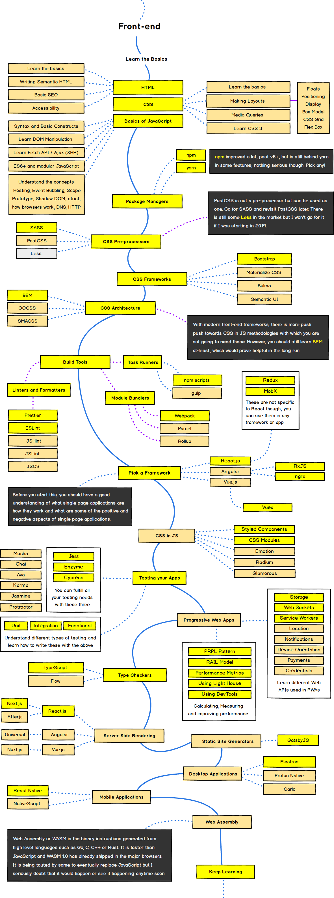
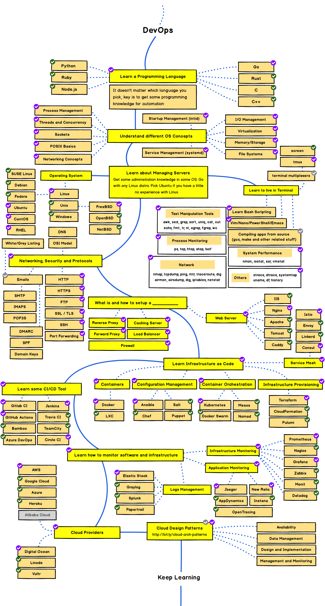

# Syntra Web Development

> The website can be found [here](https://temmermans.github.io/syntra-web-development-intro/#/)

## Getting started

1. Install nodejs from this site: [Node.JS](https://nodejs.org/en/)
2. Install VS Code from this site: [VS Code](https://code.visualstudio.com/download)
3. Install Github Desktop from here: [Github Desktop](https://desktop.github.com/)
4. Install Postman from here: [Postman](https://www.postman.com/downloads/)
5. Clone the github repo from [here](https://github.com/Temmermans/syntra-web-development-intro)

## The overview

Web development is vast, too much to see in one course. This learning path can help to position the concepts you learn about.

Let's get started!

- [Intro to Computer Science](/intro-to-computer-science/README)
- [Vanilla Javascript](/vanilla-javascript/README)
- [Intro to React](/intro-to-react/README)
- [Intro to Express](/intro-to-express/README)
- [Intro to Testing](/intro-to-testing/README)
- [Deployment Options](/deployment-options/README)
- [Integrated Exercise](/integrated-exercise/README)
