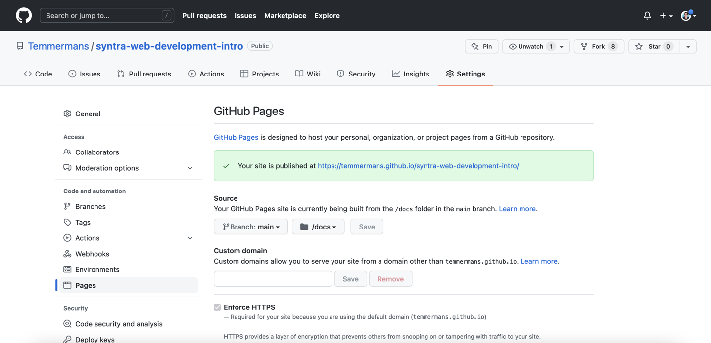
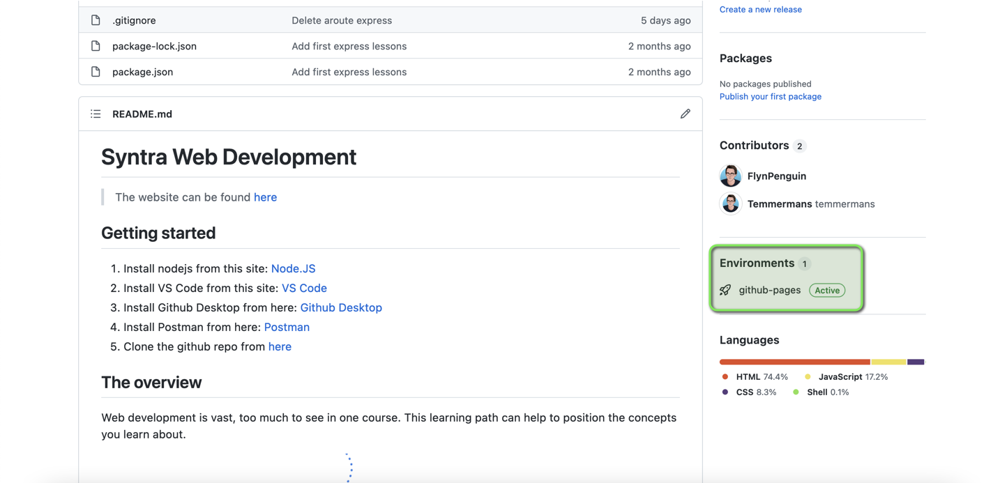

GitHub Pages is one of the fastest and most widely-used methods for beginners to deploy websites. With GitHub Actions, you can trigger automatic deployments, configure CI/CD, and much more — which make it easier to maintain than many other tools described in this guide.

Create a GitHub account if you haven’t already, then create a repository for your application.

You’ll get both the repository URL and the Git URL when you create a new repository.


In your terminal or using github desktop, initialize the local directory as a Git repository, commit all the changes, and push it to remote by running the following command in the project root.

```bash
git init
git add .
git commit -m "initial commit"
git remote add origin (repository remote git url here)
git push -u origin master
```

Navigate to the pages settings page and configure the folder from the branch and repo it should serve from:



Every time you push changes to the branch you selected, the changes will be automatically deployed using github actions:



You can also selected jekyll themes to style your website (you can ofcourse do that yourself too). More info can be found [here](https://pages.github.com/).
