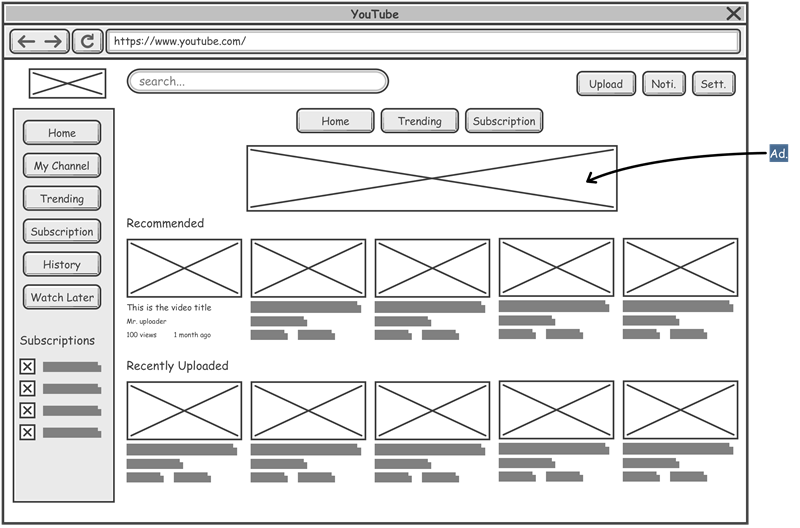
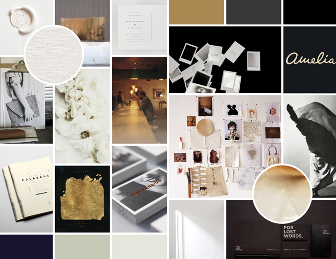

## Content

Content is a tool? Sure it is. It’s what leads traffic to your page. It’s what tells the reader what you want them to know, what you want them to do and where you want them to go.

Before you design, spend some time thinking about your content. For example, your homepage… what do you want to say there? What you say and how you say it will have a huge impact on the look and layout of the page. You need to allow for appropriate space, decide what content is most important and what’s secondary, etc.

By developing your content (or at least a draft) before your design, you will avoid a lot of headaches down the road. Writing your content as a preparatory exercise for design will get you thinking about how your content works with your website’s design to get results.

### Benefits of Prepping Your Website Content in Advance:

- Helps solidify a theme and goal set
- Forces you to engage all stakeholders from the beginning when it is most important
- Gets you thinking about keywords and SEO and how to work them into your content

## Wireframes

A wire frame is a gray scale layout of a website’s homepage, subpage or landing page. It is a great first step when starting the layout process. It helps you determine the ideal spatial arrangement of the information on your page before you even decide on color, imagery, textures, etc.

### Benefits of Using Wire Frames in Web Design:

- Saves a lot of back and forth during the design process because the layout is predetermined
- Helps you to visualize the page and make a more informed decision regarding layout before you are too far into the design process
- Helps a team develop a cohesive approach by seeing what areas each stakeholder gets on a page. It eliminates bad blood down the road, because the team can put its 2 cents in now before it’s too late

## Moodboard

A mood board, also called a style guide, is a way to organize the creative concepts and ideas in one place for your team to review. These can include elements we’ve discussed like imagery, color schemes, textures, logos, fonts, etc.

### Benefits of Using Mood Boards in Web Design:

- Before you spend too much time on designing with certain colors or textures, you can decide with your team if anything simply will not work
- It is a good visual checklist for your team to determine that all elements are there. You might think you have everything and end up missing an important image or logo.
- It helps to streamline the design process by developing an early cohesion with all stakeholders regarding design themes and elements
