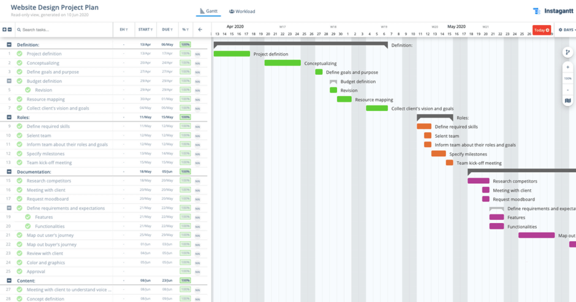
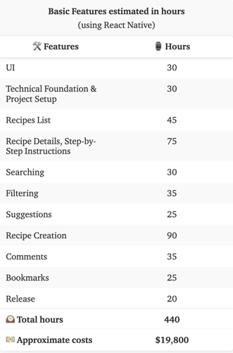

## Planning

To capture the planning of a web project and present it to your client, you need to be clear in which phases the project can be divided.

It’s important to know aspects such as the tasks to be carried out, available resources, unforeseen events that may arise, etc, in order to be able to create a timing that adjusts to reality.

The final delivery time is often given by the client. However, based on your experience, you’ll know how much time you usually spend developing similar web projects.

Therefore, the first thing is to set up the delivery date and then subdivide that final deliverable into parts that will be distributed over the total project time.

## Cost

Deliverable can look like this:

