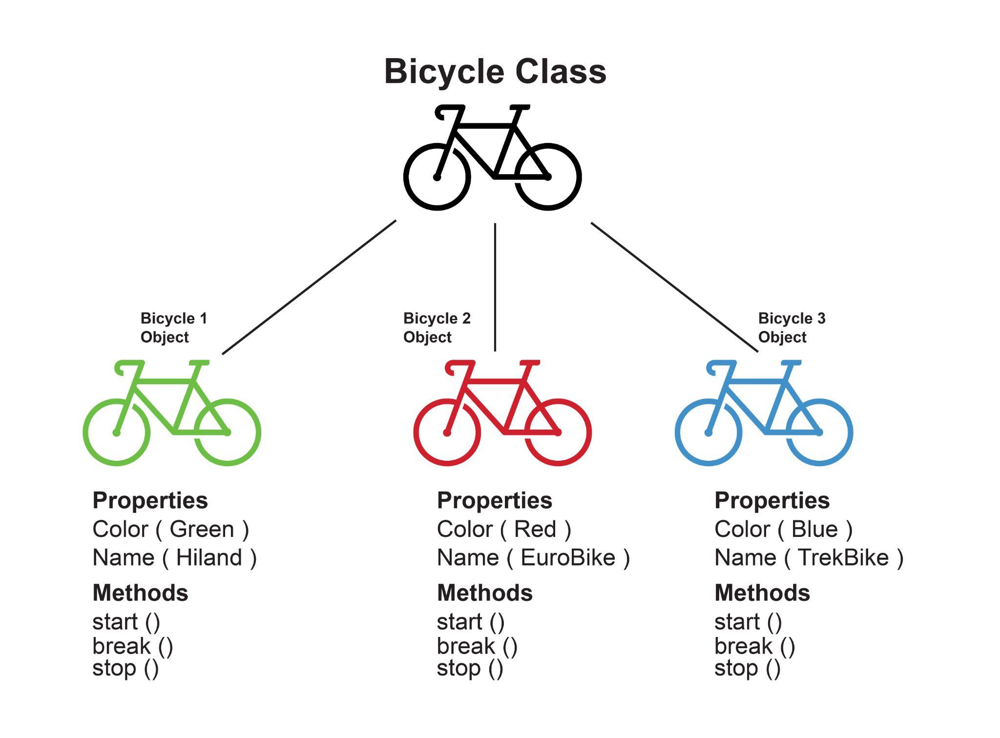

## Classes

Classes are a template/blueprint for objects. They simplify the process of creating multiple objects with similar properties and methods. Classes were not present in ES5 and were introduced in the ES6 version of JavaScript. Classes are merely syntactic sugar in JavaScript, built on top of prototypes, and work in the same manner behind the scenes.



Before javascript classes:

```js
function Person(name) {
  this.name = name;
}

Person.prototype.getName = function () {
  return this.name;
};

var john = new Person("John Doe");
console.log(john.getName());
```

With javascript classes:

```js
class Person {
  constructor(name) {
    this.name = name;
  }
  getName() {
    return this.name;
  }
}
```

## Classes explained

```js
const user1 = {
  fName: "Mary",
  lName: "Jane",
  age: 23,
  id: 01,
};

const user2 = {
  fName: "John",
  lName: "Doe",
  age: 47,
  id: 02,
};

const user3 = {
  fName: "Jane",
  lName: "Doe",
  age: 34,
  id: 03,
};

const user4 = {
  fName: "John",
  lName: "Smith",
  age: 18,
  id: 04,
};
const user5 = {
  fName: "Mary",
  lName: "Anne",
  age: 22,
  id: 05,
};
```

In the example above, the code has a lot of repetitiveness as all the objects have similar properties. We can easily eliminate the repetitiveness in code and make it more organized by using a class.

In JavaScript, the class keyword is used to create a class. Classes in JavaScript use a method named constructor(). It automatically executes when creating a new object. It initializes the properties of the object.

```js
class User {
  constructor(firstName, lastName, age, id) {
    this.fName = firstName;
    this.lName = lastName;
    this.age = age;
    this.id = id;
  }
}
```

In the example above, we have created a new class named User. It serves as a template/blueprint for all the user objects we want to make. The constructor takes four arguments and makes four properties for each object. These properties are named fName, lName, age, and id and can be accessed by using the following syntax (after we have created the object)

The ‘this’ keyword in the example refers to the object that owns the age property. This keyword is used to access the value of a property within an object.

This are the same users as before:

```js
class User {
  constructor(firstName, lastName, age, id) {
    this.fName = firstName;
    this.lName = lastName;
    this.age = age;
    this.id = id;
  }
}

const user1 = newUser("Mary", "Jane", 23, 01);
const user2 = new User("John", "Doe", 47, 02);
const user3 = new User("Jane", "Doe", 34, 03);
const user4 = new User("John", "Smith", 18, 04);
const user5 = new User("Mary", "Anne", 22, 05);
```

## What are methods in JavaScript classes

We can also add methods to classes in JavaScript. These methods can be easily added to the body of the class after the constructor by using the same syntax which is used in objects:

```js
class User {
  constructor(firstName, lastName, age, id) {
    this.fName = firstName;
    this.lName = lastName;
    this.age = age;
    this.id = id;
  }
  birthYear() {
    const date = newDate();
    let Year = date.getFullYear() - this.age;
    return Year;
  }
}

const user1 = new User("Mary", "Jane", 23, 01);
const user2 = new User("John", "Doe", 47, 02);
const user3 = new User("Jane", "Doe", 34, 03);
const user4 = new User("John", "Smith", 18, 04);
const user5 = new User("Mary", "Anne", 22, 05);
```

Now, if we try to access the birthYear() method and print it on the console using the console.log() method, then what will be the output?

## Fluent API

A useful object-oriented pattern in JavaScript and other languages is the "fluent API" (aka fluent interface).
Using this pattern can make your code much easier to read and to write.
