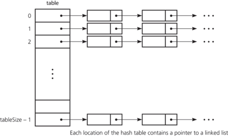

## Hash Table

A hash table is basically an array that links a key to a specific data value. For example, say we want to create a database that stores the profile information of all users of a website; in that case, the keys would be the names of the users and the values would be their profile information, including things like their date of birth, e-mail address, nationality, etc.

But how do we actually go about placing this whole system on top of an array? The indexes of the slots in an array are whole numbers, not usernames, right?

We use hash functions to turn the keys into integers. They’re basically magic number machines that can take in information of any length and spit a number of fixed size back out. For example, let’s say my username on the website from the previous example was “ramyzhang”. We would input that string into a hash function, and the function will do a bunch of calculations to spit out a number of, say, 5 digits, or a number that only goes up to a maximum of 10 (depending on what kind of hash function it is). This number will always be associated to the string “ramyzhang”, no matter how many times you put “ramyzhang” through the function.

Then, since the resulting hash is an integer, you can just go and directly use that number as the index for the profile information of user “ramyzhang”.

### The chaining method

Let’s just take a quick pause think about hash functions for a second— since we’re converting data of any length (x) into data of fixed size (y), dataset x will be way larger than dataset y. There are infinite entries in dataset x, but limited ones in dataset y because all the numbers have to be a certain size or length. In other words, there could possibly be two or more pieces of data in dataset x that will hash to the same integer in dataset y.

This is called the **collision problem**, and here’s what you can do to deal with it:

When two or more pieces of data collide and hash to the same integer (index), we could simply link the data up into a linked list at that index of the array, as you can see above.

Of course, this is the kind of situation we’re going to want to avoid, because instead of using constant time O(1) to find a key and its corresponding information in the array, we end up needing linear time O(n) to actually walk through the linked lists to find our actual values.
