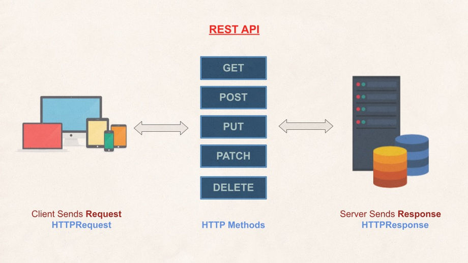

## What is an API?

While the way people talk about APIs sounds horribly complex, in reality they are very easy to understand. That said, if you run a website or supervise people who do web development, you do need to understand what an API is – and why they are mission critical to your business.

An API (Application Programming Interface) is simply some software that sends information back and forth between a website or app and a user.

Imagine back in the day, before cell phones. You’re in your house. Your mother is in a house down the block. You need to ask her for a recipe. But you’re too busy to run down the road yourself. So you send one of your kids with a message for your mom. Your kid runs down there, gets the recipe, and brings it back to you.

In this example, your kid is the API. You stay where you are. Your mom stays where she is. Your child brings your message to her, and then brings her response back to you.

Basic data operations of an API are:

- Create
- Read
- Update
- Destroy

In short this is called CRUD.

## Why APIs Are Important?

The first reason why APIs matter is that your site, app or service isn’t doing anything without them. You need them to process an order and confirm payment if you are selling anything. You need them to collect data if that is the goal of your solution. A service can’t just sit there doing nothing. The Internet is too interactive for that.

The second reason is that APIs these days are packaged as products that developers can use to build your site or app or even to add value or a new way to deliver value for the systems you build.

## What is REST?

REST API is an application programming interface which can be used by multiple clients to communicate with a server. Rest API is a kind of web-service which stores and retrieves necessary data. It provides great flexibility to developers since it does not need any dependent code libraries to access the web-services. Amongst the many protocols supported by REST, the most common one is HTTP. When a request is sent from the client using a HTTPRequest, a corresponding response is sent from the server using HTTPResponse. The most widely used machine readable format supported for requests and responses are JSON (Javascript Object Notification) and XML (Extensible Markup Language)

