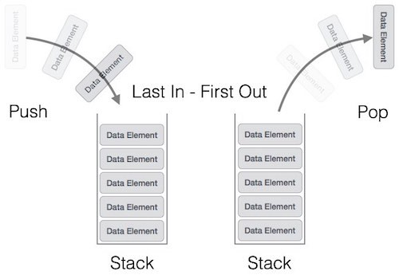

Stacks and queues are essentially dynamic, linear arrays in which you can only manipulate the insertion and deletion of data entries in one specific way.

As its name suggests, you can think of a stack as a stack of plates; when you want to add a plate to the stack, you have to put it on the top of the stack. Likewise, when you want to take out a plate, you can only take out the topmost plate on the stack, i.e. the one you added last. Therefore, stacks are LIFO — Last In, First Out. Stacks therefore have two main functions: one, called push, is when you insert items onto the “top” of the stack. The other, called pop, is when you remove the topmost element on the stack and retrieve its data.

On the other hand, for a queue, you can imagine it as a group of people lining up for a movie; the newest person to join is added to the end of line, whereas the first person to leave the queue was the first in the line. Therefore, queues are FIFO — First In First Out. Usually the two methods we use to alter queues are enqueue, which adds a value to the end of the queue, and dequeue, which removes and returns the frontmost (or oldest) entry in the queue.

**Applications of stack**

1. used in "undo" mechanism in text editor.
2. Backtracking (game playing, finding paths, exhaustive searching.
3. Memory management, run-time environment for nested language features. etc

**Applications of Queue**

1. When data is transferred asynchronously (data not necessarily received at same rate as sent) between two processes. Examples include IO Buffers, pipes, file IO, etc.
