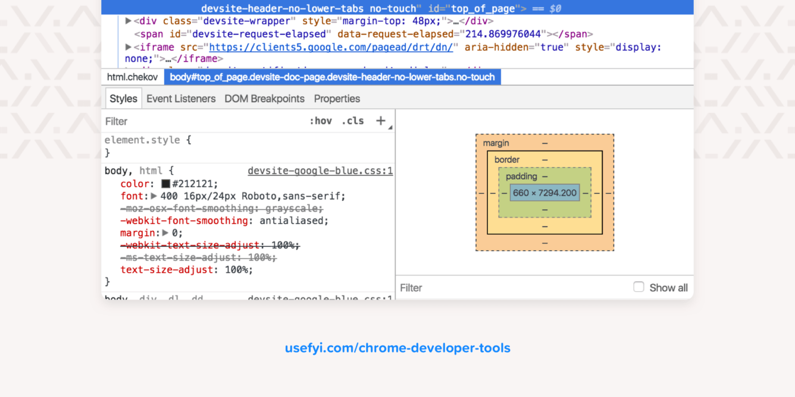

## Dev Tools Domination



There are three tabs at the top of the Developer Tools window, and a further six that you can see by clicking the >> symbol next to them.

The tabs are:

1. Elements
2. Console
3. Source
4. Network
5. Application
6. Security
7. Memory
8. Performance
9. Audits

**Elements** shows you the HTML used to build the page you’re looking at, together with any inline CSS.

**Console** deals with JavaScript. It gives you information about interactive elements on a page. In Console, you can write JavaScript to interact with the web page you’re viewing, and it also lets you write messages to yourself in the JavaScript of websites you’re building, which then show up in Console to show that the JS was executed.

The **Sources** tab shows you where all the files that were used to make the website are stored and lets you inspect them.

The **Network** tab shows you all the files that are loading in the URL you’re looking at.

**Application** shows you what’s in your browser storage: in-browser databases like Web SQL, local storage, and more. It also gives you granular control over your cookies.

**Security** gives you basic security information, letting you view a site’s HTTPS certificate and TLS status.

### How to open Chrome Developer Tools

You can open Developer Tools with keyboard shortcuts or through the Chrome menu.

The keyboard shortcuts are:
-Mac OS: CMD+Shift+J or CMD+Shift+C
-Linux, Chromebook and Windows: Ctrl+Shift+J
-Finally, you can right-click (Windows) or Ctrl-click (Mac) anything on a web page and select “Inspect Element” to open Developer Tools.

### Custom plugins

When working on apps and websites with the likes of react or appollo. You can install plugins for the dev tools. They will show up as extra tabs. Here are some examples:

1. [React Dev Tools](https://addons.mozilla.org/nl/firefox/addon/react-devtools/)
2. [Apollo Dev Tools](https://addons.mozilla.org/en-US/firefox/addon/apollo-developer-tools/)

### Practice

For our excercises, we are going to focus on the console. The console is a very handy tool for debugging and understanding what is going on within your application. We are going to work with the console object.
Keep this [page](https://developer.mozilla.org/en-US/docs/Web/API/console) open and go to the following file:

```
2. Vanilla Javascript/03 - Dev Tools Domination/index-START.html
```
