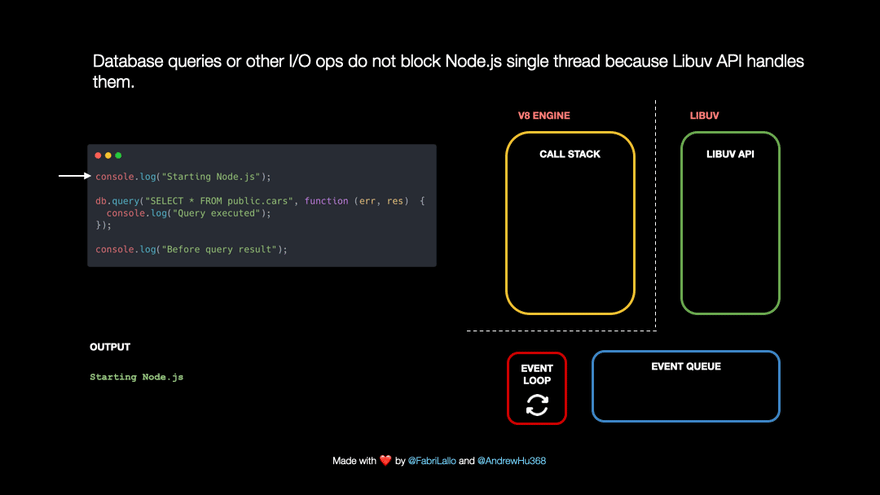

## The event Loop

JavaScript is single-threaded: only one task can run at a time. Usually that’s no big deal, but now imagine you’re running a task which takes 30 seconds. During that task we’re waiting for 30 seconds before anything else can happen (JavaScript runs on the browser’s main thread by default, so the entire UI is stuck) 😬

Luckily, the browser gives us some features that the JavaScript engine itself doesn’t provide: a Web API. This includes the DOM API, setTimeout, HTTP requests, and so on. This can help us create some async, non-blocking behavior 🚀

When we invoke a function, it gets added to something called the call stack. The call stack is part of the JS engine, this isn’t browser specific. It’s a stack, meaning that it’s first in, last out (think of a pile of pancakes). When a function returns a value, it gets popped off the stack 👋


The respond function returns a `setTimeout` function. The `setTimeout` is provided to us by the Web API: it lets us delay tasks without blocking the main thread. The callback function that we passed to the setTimeout function, the arrow function `() => { return 'Hey' }` gets added to the Web API. In the meantime, the setTimeout function and the respond function get popped off the stack, they both returned their values!


> [!INFO]
> A similar thing happens when we run javascript in a nodejs environment. Instead of the web API (which is ofcourse a browser thing), nodejs has the libuv API.
> 

Time for the event loop to do its only task: connecting the queue with the call stack! If the call stack is empty, so if all previously invoked functions have returned their values and have been popped off the stack, the first item in the queue gets added to the call stack. In this case, no other functions were invoked, meaning that the call stack was empty by the time the callback function was the first item in the queue.


### Some Practice

What does the following log:

```js
const foo = () => console.log("First");
const bar = () => setTimeout(() => console.log("Second"), 500);
const baz = () => console.log("Third");

bar();
foo();
baz();
```


### [JS Visualizer playground](https://www.jsv9000.app/?code=c2V0VGltZW91dChmdW5jdGlvbiBhKCkgeyBjb25zb2xlLmxvZygnTWFjcm8gVGFzaycpIH0sIDApOwoKUHJvbWlzZS5yZXNvbHZlKCkKLnRoZW4oZnVuY3Rpb24gYigpIHsgY29uc29sZS5sb2coJ01pY3JvIHRhc2snKSB9KTsKCmNvbnNvbGUubG9nKCdZbycpOw%3D%3D)

<iframe height="600" src="https://www.jsv9000.app/?code=c2V0VGltZW91dChmdW5jdGlvbiBhKCkgeyBjb25zb2xlLmxvZygnTWFjcm8gVGFzaycpIH0sIDApOwoKUHJvbWlzZS5yZXNvbHZlKCkKLnRoZW4oZnVuY3Rpb24gYigpIHsgY29uc29sZS5sb2coJ01pY3JvIHRhc2snKSB9KTsKCmNvbnNvbGUubG9nKCdZbycpOw%3D%3D">
