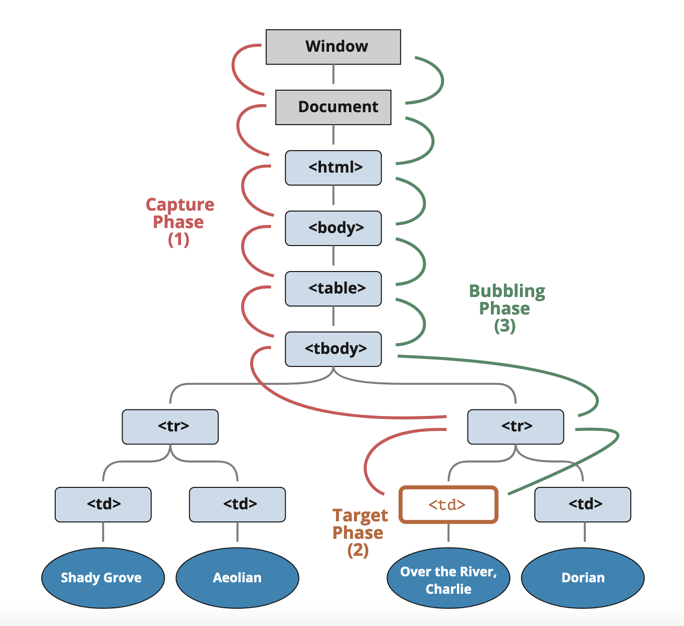

## Event Capture, Propagation, Bubbling and Once

Let’s start with an example.

This handler is assigned to `<div>`, but also runs if you click any nested tag like `<em>` or `<code>`:

```html
<div onclick="alert('The handler!')">
  <em>If you click on <code>EM</code>, the handler on <code>DIV</code> runs.</em>
</div>
```

### Bubbling

The bubbling principle is simple.

When an event happens on an element, it first runs the handlers on it, then on its parent, then all the way up on other ancestors.

Let’s say we have 3 nested elements FORM > DIV > P with a handler on each of them:

```html
<form onclick="alert('form')">
  FORM
  <div onclick="alert('div')">
    DIV
    <p onclick="alert('p')">P</p>
  </div>
</form>
```

A click on the inner `<p>` first runs onclick:

- On that `<p>`.
- Then on the outer `<div>`.
- Then on the outer `<form>`.
- And so on upwards till the document object.

> The most deeply nested element that caused the event is called a target element, accessible as `event.target`.

To stop the bubbling, use:

```html
<body onclick="alert(`the bubbling doesn't reach here`)">
  <button onclick="event.stopPropagation()">Click me</button>
</body>
```

In other words, `event.stopPropagation()` stops the move upwards, but on the current element all other handlers will run.

To stop the bubbling and prevent handlers on the current element from running, there’s a method `event.stopImmediatePropagation()`. After it no other handlers execute.

### Capturing

There’s another phase of event processing called “capturing”. It is rarely used in real code, but sometimes can be useful.

The standard DOM Events describes 3 phases of event propagation:

- Capturing phase – the event goes down to the element.
- Target phase – the event reached the target element.
- Bubbling phase – the event bubbles up from the element.



```html
<form>
  FORM
  <div>
    DIV
    <p>P</p>
  </div>
</form>

<script>
  for (let elem of document.querySelectorAll("*")) {
    elem.addEventListener("click", (e) => alert(`Capturing: ${elem.tagName}`), true);
    elem.addEventListener("click", (e) => alert(`Bubbling: ${elem.tagName}`));
  }
</script>
```

If you click on `<p>`, then the sequence is:

- HTML → BODY → FORM → DIV (capturing phase, the first listener):
- P (target phase, triggers two times, as we’ve set two listeners: capturing and bubbling)
- DIV → FORM → BODY → HTML (bubbling phase, the second listener).

### Once

An option that can be passed to an event. From the mozilla docs:

> A boolean value indicating that the listener should be invoked at most once after being added. If true, the listener would be automatically removed when invoked.

```js
button.addEventListener(
  "click",
  () => {
    console.log("Click!!!");
  },
  {
    once: true,
  }
);
```
